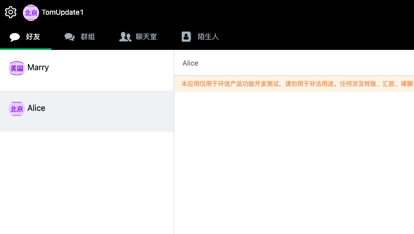

## 个人属性

1. 个人属性，使用环信的metadata的属性
2. 业务上自己的数据，绑定到个人账号的数据

两种数据从本质上维持不同数据中心单独维护自己的数据，环信侧的数据和业务侧数据基本保持一致，这里仅仅进行
简单的举例，介绍核心的概念

### 环信侧数据

1. 头像数据
2. 昵称

### 示例

获取用户nickname和头像



上图中的背景TomUpdate1是tom自己的昵称，下面的Marry， Alice分别为Marry和Alice的昵称。
头像这里为了区分不同的数据中心，所以把北京和美国两个头像分别进行标识，从图中可以看到Tom和Alice都是
北京数据中心的账号，Marry为美国数据中心的账号。

#### 代码示例

下面的示例以webim的示例为主

```js
let promises = roster.map(item => {
let rosterDc = item.name.split("_")[0];
if (WebIM.config.dc == rosterDc) {
    return WebIM.conn.fetchUserInfoById(item.name)
        .then(res => {
            item.info = res.data[item.name];
            console.log('get metadata', item);
            return res.data;
        });
    } else {
        return axios.get(`${WebIM.config.otherRestServer}/metadata/${WebIM.config.otherApp}/${item.name}`)
        .then(res => {
            item.info = res.data.data;
            console.log('get metadata', item, res.data.data);
            return res.data;
        });
}
});
await Promise.all(promises)
.then(() => {
    console.log('get metadata done');
});
```

