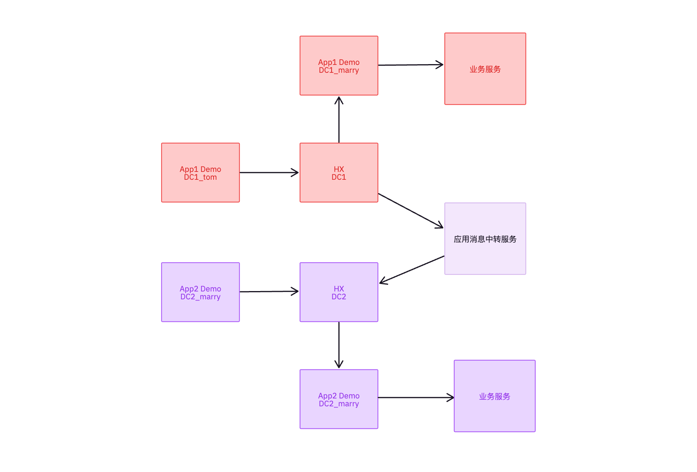

## 单聊消息的打通

目标： 数据中心1的用户能够跟用户中心2的账号完成一对一的消息通信

申请appkey按照预先定义的方式

app1：dc1

app2: dc2

userId: dc1_tom, dc2_marry

核心解决的点：
1. appkey级别能够识别对应的数据中心
2. 用户级别能够识别对应的数据中心

### 过程详解

- dc1_tom发送消息给dc2_marry的账号

- 通过配置hx1的回调，appServer1接收到该消息，判断该消息为跨应用的消息
    
    由于延时没有特别的要求，此处可以通过发送后的回调，既不影响发送者的发消息体验，也能实现相应的功能

- appServer1将消息直接转发给hx2的服务，

    消息的内容需要进行适当的修改

    appkey从当前的app1变更为app2

    经过上述的变更，实现了消息从dc1到dc2的转变，又可以通过app1和app2来达到区分不同应用的目的

### 后续平台级支持

appkey: ${dc}#${org_name}#${app_name}

userid: ${dc}_${userid}